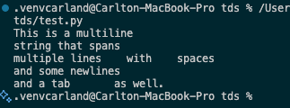
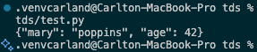
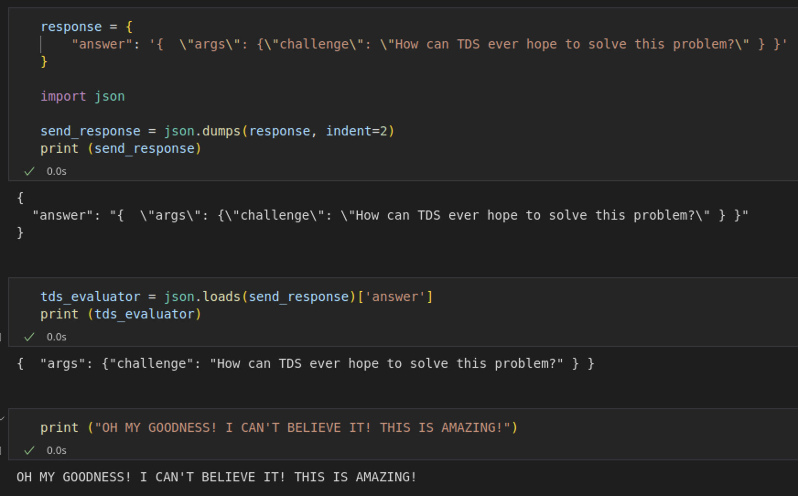

# Handling newline characters in markdown response

Your markdown must have newline characters or spaces wherever necessary. Otherwise we will not be able to check if your answer is correct. Our parser will only work if encodings for the formatting are present in the response. If there are no encodings (invisible or visible) then we will not have the correctly formatted file.

Please review module 1 for a better understanding about how text is encoded. Especially invisible characters.

The browser is designed for user friendliness. Thats why the characters are invisible when you copy paste string with newlines. But it exists.

The programmatic strings show invisible encodings as escaped characters. (Usually)

To check if a string has invisible characters,

```python
## Multi-line string
my_string = """Hello
World    with    spaces 
and some newlines
and a tab """
```

```python
## Print ASCII values of each character
print([ord(c) for c in my_string])
e.g., newline = 10, tab = 9
```

This is a great way to check what we are receiving when you send us some response,

```python
import requests
import json

## This is just an example server to see what we see.

url = "https://httpbin.org/post"

my_multiline_string_answer = """This is a multiline
string that spans
multiple lines    with    spaces 
and some newlines
and a tab as well."""

response_to_send_to_tds_evaluator = {
"answer": my_multiline_string_answer
}

# Send the JSON data
response = requests.post (url, json=response_to_send_to_tds_evaluator)

# Check the response
print (response.status_code)
print (response.json ())
print (response.text)

# Do other checks as necessary... 
```

See what happens when I print the result

```python
print (json.loads (response.text)['json']['answer'])
```



Its a proper multiline correctly formatted text! The encodings are invisible just like in the original as well as in your clipboard when you copy paste into the GA.

Here is a json example:

```python

json_answer = {
    "mary": "poppins",
    "age": 42
}

stringed_json = json.dumps (json_answer)
response_to_send_to_tds_evaluator = {
"answer": stringed_json
}

response = requests.post (url, json=response_to_send_to_tds_evaluator)

print (json.loads (response.text)['json']['answer'])
```

Look at the response. A perfect json


If you do not want spaces in the response then strip the spaces before you send the stringified response.

# JSON escape sequence

The correct answer has to be with the escape sequence otherwise you cannot send a valid response back.
We never feed your response to the GA by copy pasting.



# Enabling 'Check all' button

```javascript

inputs = document.querySelectorAll('input')
textboxes = document.querySelectorAll("textarea")
buttons  = document.querySelectorAll("button")
inputs.forEach(input => input.removeAttribute('disabled'));
buttons.forEach(input => input.removeAttribute('disabled'));
textboxes.forEach(input => input.removeAttribute('disabled'));

```

# Reference Repository with working code

<https://github.com/Tusharisme/TDS_Project_2>

# Live sessions

<https://www.youtube.com/watch?v=RToHBe6yB_4>

# Some points to note

## Questions to be hardcoded

* NPX question
* Moving files and getting sha256 sum

## Other notes

* Question asking for vercel deployment can use end points other than vercel too
* Questions which have URL, it will be sent as URL in the question itself and not as files. The questions which have button to download the file will be sent as file parameter

# To do

* Creating mechanism to pass from vercel to local instance
* GA4 Q6 for hacker news - bs4 is giving some error on not being able to find the parser, although original code runs fine
* GA4 Q7 - getting Github users - getting error "HTTP error occurred: 403 Client Error: rate limit exceeded for url: <https://api.github.com/user/137277687>"
* GA4 Q9 - Tabula installation requires Java Runtime to be installed

